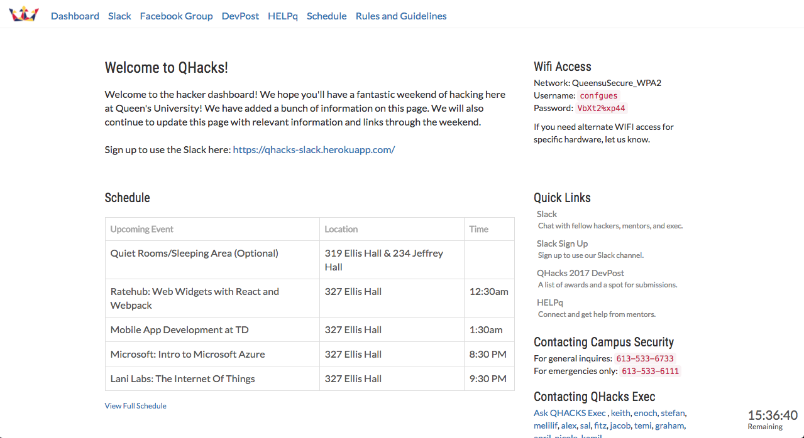

# hacker-dashboard
The day of hacker dashboard for QHacks 2017. Here is a [walkthrough video](https://www.youtube.com/watch?v=BdvwEScrYTo) or [example from QHacks](https://qhacks.github.io/hacker-dashboard/).

## Deploying
It's pretty simple, update the data in `/js/main/data.js`. This file contains:
- The schedule
- Exec contact information
- The end date and time of the hackathon
- The hackathon logo
- The name of the hackathon
- Introduction information
- The quick links
- Link to DevPost (If empty doesnt show)
- Link to participants Facebook group (If empty doesnt show)
- Link to participants Slack (If empty doesnt show)
- Link to HelpQ (If empty doesnt show)
- Link to Hardware
- Link to Challenges
- Methods for contacting Campus Security
- Wifi Information

This dashboard can also be found with Github Pages. You have to update your DNS for your domain and add a "A" record, make the name to be "@" and point to "192.30.252.153". Add another record for CNAME, make the name to be "www" and point to "REPO_NAME". REPO_NAME would be the Github pages link (Ex. kweaver00.github.io). Also update the CNAME file in this repo to your domain or subdomain.

